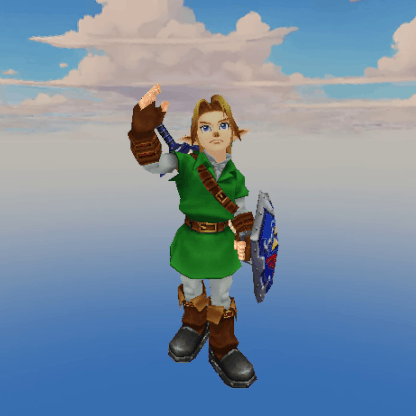

# Software 3D Renderer

A software rasterizer written in C, with no graphics API. All rendering (vertex transformation, clipping, rasterization, and texturing) runs on the CPU using SDL2 only for window management and pixel buffer presentation. This is an educational project, and is based on and extended from [Pikuma's 3D Computer Graphics course](https://pikuma.com/courses/learn-3d-computer-graphics-programming).



*Link model © Nintendo. Used for demonstration purposes only.*

## Features

- **Perspective-correct texture mapping**: UV coordinates and depth are interpolated using barycentric weights divided by `1/w`, correcting the affine distortion that plagues simpler scanline renderers
- **Z-buffer depth testing**: per-pixel `1/w` depth buffer enables correct occlusion for complex, overlapping geometry
- **View-frustum clipping (Sutherland-Hodgman)**: polygons are clipped against all six frustum planes in view space before projection, correctly handling geometry that straddles the near plane
- **Backface culling**: faces whose normal dot product with the camera ray is negative are discarded before the projection stage
- **Cubemap skybox**: six-face skybox rendered in a separate depth-bypassed pass so geometry can always overdraw it without z-fighting
- **MTL material parsing**: OBJ/MTL loader resolves per-face material assignments and loads each referenced texture, supporting models with multiple materials and texture atlases
- **Multiple simultaneous meshes**: scene graph supports loading and transforming several independent OBJ meshes per frame
- **FPS camera with mouse look**: SDL relative mouse mode drives yaw/pitch rotation; WASD + Q/E for 6DOF movement
- **Orbit camera mode**: press `O` to auto-orbit the camera around the loaded mesh's world-space centroid
- **Multiple render modes**: toggle at runtime between wireframe, flat-shaded, textured, and combined modes (keys `1`–`6`)
- **Directional lighting**: flat shading intensity computed from `dot(face_normal, light_dir)` applied as a color scale

## Pipeline Overview

```
OBJ/MTL load
  ↓
world transform (TRS matrices)
  ↓
view transform (LookAt)
  ↓
backface cull
  ↓
frustum clip 
  ↓
perspective project
  ↓
NDC (normalized device coordinates) → screen space
  ↓
rasterize (scanline)
  ↓
z-test
  ↓
texel sample
```

Each frame the pipeline runs entirely on the CPU. Matrices are built from explicit scale, rotation (X/Y/Z), and translation components and combined with matrix multiplication. Projection uses a standard perspective matrix with configurable FOV, aspect ratio, and near/far planes.

## Controls

| Key | Action |
|-----|--------|
| `W/A/S/D` | Move camera forward/strafe |
| `Q/E` | Move camera up/down |
| Mouse | Look (yaw/pitch) |
| `O` | Toggle orbit mode |
| `[` / `]` | Decrease/increase orbit speed |
| `1` | Wireframe + vertices |
| `2` | Wireframe only |
| `3` | Flat shaded |
| `4` | Flat shaded + wireframe |
| `5` | Textured |
| `6` | Textured + wireframe |
| `C` | Enable backface culling |
| `X` | Disable backface culling |
| `Esc` | Quit |

## Build

```sh
make
make run 
```

## Implementation Notes

The rasterizer uses a flat-top/flat-bottom triangle decomposition with a scanline fill. Perspective-correct interpolation divides interpolated `u/w` and `v/w` by the interpolated `1/w` at each pixel. The z-buffer stores `1 - 1/w` so that values closer to the viewer are smaller, matching standard depth buffer conventions.

Frustum clipping operates on polygons (not triangles) so that a clipped triangle can produce up to 9 vertices. After clipping, the polygon is re-triangulated into a fan before projection.

The skybox renders on a unit cube scaled to ±10 world units. It runs in a dedicated first pass with depth writes disabled, then the z-buffer is cleared before scene geometry renders: this avoids skybox faces z-fighting each other while letting any geometry overdraw the sky correctly.

